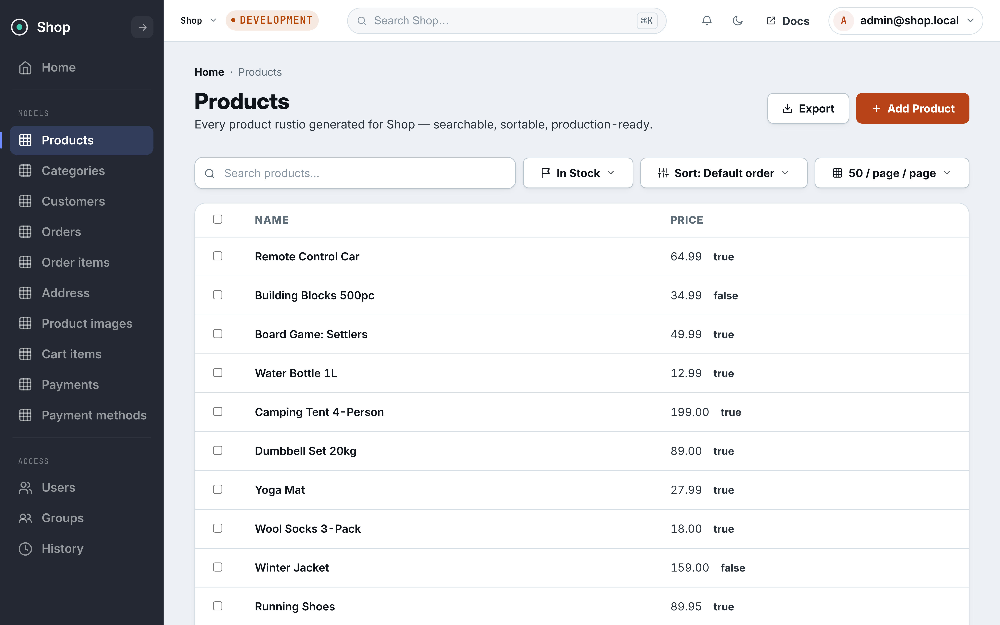

<p align="center">
  
</p>

<p align="center">
  <strong>Generate real admin systems in Rust.</strong><br>
  Define your domain. RustIO Admin builds the operational foundation. You own the business logic.
</p>

<p align="center">
  <a href="https://crates.io/crates/rustio-admin"></a>
  <a href="https://crates.io/crates/rustio-admin-cli"></a>
  <a href="https://docs.rs/rustio-admin"></a>
  <a href="https://abdulwahed-sweden.github.io/rustio-admin/"></a>
  <a href="https://github.com/abdulwahed-sweden/rustio-admin/actions/workflows/ci.yml"></a>
  <a href="./LICENSE"></a>
  <a href="https://github.com/sponsors/abdulwahed-sweden?metadata_source=rustio_admin&metadata_campaign=readme_top"></a>
</p>

---

<p align="center">
  
</p>

## What it is

RustIO Admin generates the foundation for operational software from Rust models.

It is designed for teams that need more than CRUD from day one:

- authentication and sessions
- roles and permissions
- account recovery
- audit trails
- Postgres-first persistence
- generated admin UI
- search, filtering, sorting, and export
- a project structure you own

**The idea is not “write less code at any cost.”** The idea is to stop rebuilding the same security-sensitive foundation in every internal system.

<p align="center">
  <a href="https://github.com/sponsors/abdulwahed-sweden?metadata_source=rustio_admin&metadata_campaign=value_cta"><strong>❤️ Sponsor continued RustIO Admin development</strong></a>
</p>

---

## Why it exists

Most admin frameworks make CRUD easy, then leave authentication, recovery, authority changes, and audit to separate layers.

RustIO Admin treats those concerns as one system.

That means the important questions are designed together:

- Who is allowed to do this?
- How is that authority granted or revoked?
- What happens to active sessions?
- Can a destructive action require re-authentication?
- Is the change written to an audit trail?
- Can the system explain later why access changed?

CRUD sits on top of that foundation instead of defining it.

---

## 30-second shape

```rust
#[derive(RustioAdmin)]
pub struct Task {
    pub id: i64,
    pub title: String,
}

impl ModelAdmin for Task {}

let admin = Admin::new().model::<Task>();
let router = register_admin_routes(Router::new(), admin, db, templates);
```

From the model definition, RustIO Admin can generate the administrative surface and the glue around it.

For custom list behavior:

```rust
impl ModelAdmin for Task {
    fn list_display() -> &'static [&'static str] {
        &["title", "status"]
    }

    fn list_filter() -> &'static [&'static str] {
        &["status"]
    }

    fn search_fields() -> &'static [&'static str] {
        &["title"]
    }
}
```

---

## Security-sensitive foundation

RustIO Admin includes first-class support for:

- Argon2id password hashing
- DB-backed sessions
- hashed-at-rest tokens
- role-based authorization
- re-authentication for destructive actions
- recovery flows
- typed audit events
- request correlation IDs
- redaction helpers for sensitive values

The framework deliberately keeps the surface narrow so these paths stay understandable and reviewable.

For the design contracts and security model, use the canonical docs in [`docs/`](./docs/).

---

## Install

Library:

```toml
[dependencies]
rustio-admin = "0.33"
```

CLI:

```bash
cargo install rustio-admin-cli
```

Database/authority commands are available through the CLI's database feature when needed:

```bash
cargo install rustio-admin-cli --features db
```

Check the current crate documentation for the supported Rust toolchain and feature matrix before pinning production builds.

---

## What RustIO Admin is not

- not a low-code platform
- not a generic frontend framework
- not a database abstraction over every backend
- not an AI system deciding your business logic
- not a replacement for application-specific domain code

It generates the foundation so your engineering time goes into the part that is actually unique to your system.

---

## Documentation

The canonical technical documentation lives in [`docs/`](./docs/).

Useful starting points:

- [`docs/README.md`](./docs/README.md) — documentation index
- [`docs/getting-started.md`](./docs/getting-started.md) — getting started
- [`docs/quickstart-translation-agency.md`](./docs/quickstart-translation-agency.md) — worked example
- [`MANIFESTO.md`](./MANIFESTO.md) — project philosophy
- [`CHANGELOG.md`](./CHANGELOG.md) — releases and visible changes
- [`CONTRIBUTING.md`](./CONTRIBUTING.md) — contributing

There is also a designed documentation site at **https://abdulwahed-sweden.github.io/rustio-admin/**. When the site and repository docs differ, the repository docs are the source of truth.

---

## Why sponsor?

Admin infrastructure is easy to underestimate because the visible UI is only the surface. The expensive part is ongoing maintenance of authentication, permissions, recovery, audit behavior, migrations, compatibility, release engineering, documentation, and examples.

Sponsorship helps fund that work.

If your team uses RustIO Admin, evaluates it for internal tooling, or simply wants a serious Rust-native alternative for operational software, support is directly useful.

<p align="center">
  <a href="https://github.com/sponsors/abdulwahed-sweden?metadata_source=rustio_admin&metadata_campaign=readme_bottom">
    
  </a>
</p>

---

License: [MIT](LICENSE).
